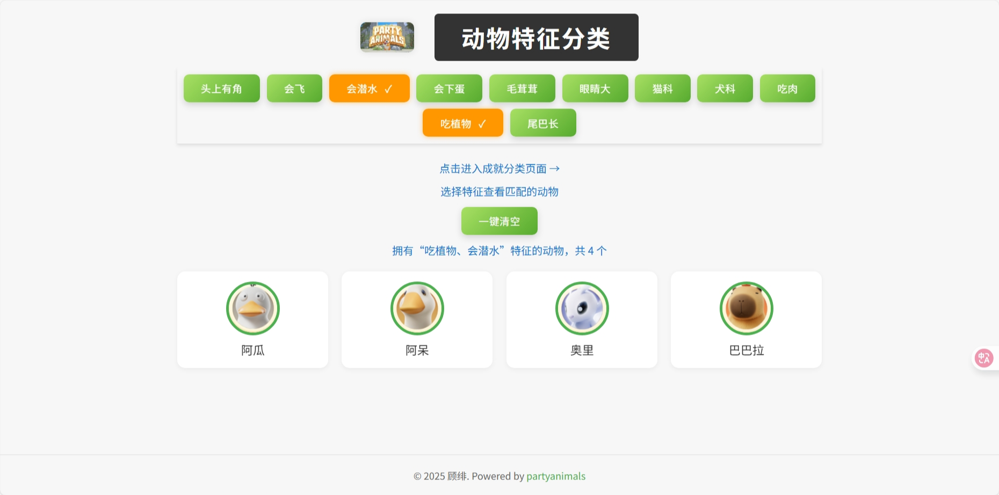

# 猛兽派对助手 (Party Animals Helper)

这是一个为游戏《猛兽派对》（Party Animals）玩家制作的轻量级Web助手工具。它提供了两个主要功能页面，帮助玩家快速查询和筛选游戏内的动物角色和成就信息。项目完全基于前端技术，无需后端支持，响应迅速，部署简单。

 

## 主要功能

- **双功能页面**：包含 **动物特征分类** 和 **成就地图分类** 两个独立页面。
- **动态实时筛选**：
    - 在动物页面，支持**多选**特征进行“与”逻辑筛选（例如，同时拥有“毛茸茸”和“会飞”特征的动物）。
    - 在成就页面，支持**单选**地图进行筛选，展示该地图下的所有成就。
- **纯客户端**：所有数据和筛选逻辑均在浏览器端通过 JavaScript 完成，加载速度快，可离线使用。
- **统一化代码**：项目采用单个智能 `app.js` 脚本驱动两个页面，根据页面标题自动适配不同的数据源和筛选逻辑（多选/单选）。
- **响应式设计**：
    - 页面布局在桌面端和移动端均有良好表现。
    - **针对移动端优化**：在小屏幕设备上（如手机），页面会整体缩放至75%，以在有限空间内展示更多信息，方便快速浏览。

## 🛠️ 技术栈

- **HTML5**
- **CSS3**:
    - Flexbox & Grid 布局
    - CSS Variables (自定义属性)
    - 媒体查询 (Media Queries)
    - `zoom` 属性
- **JavaScript (ES6+)**:
    - 无任何框架或库（Vanilla JS）
    - DOM 操作 & 事件处理

## 📁 项目结构

```
/
├── index.html          # 动物特征分类页面
├── achievements.html   # 成就地图分类页面
├── animals.css         # CSS样式文件
├── app.js              # 核心JavaScript逻辑文件
├── images/             # 存放动物头像、Logo、成就图标等图片
│   ├── achievements/   # 存放成就图标
│   └── ...
└── README.md           # 本文件
```